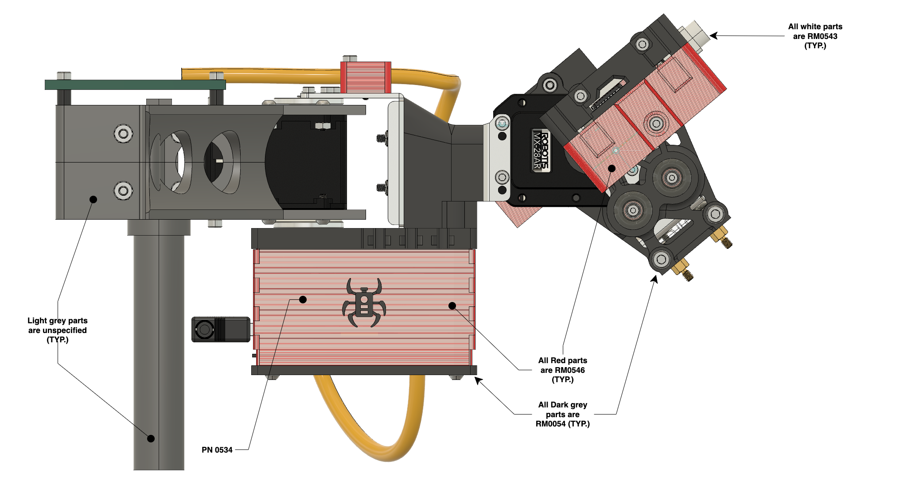
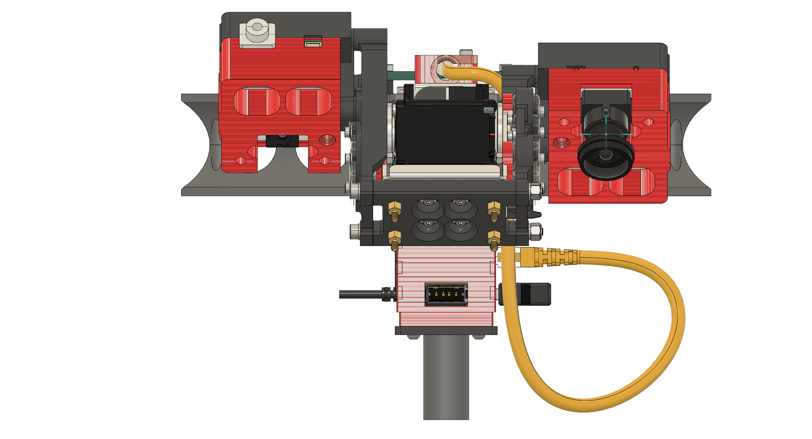
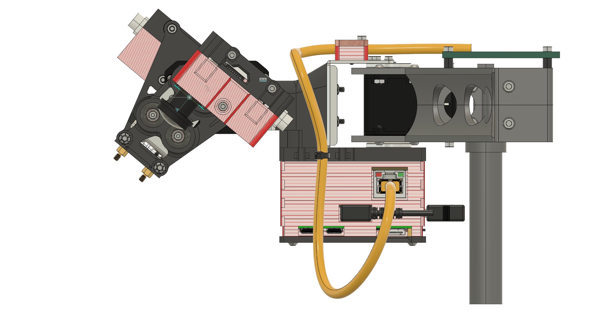
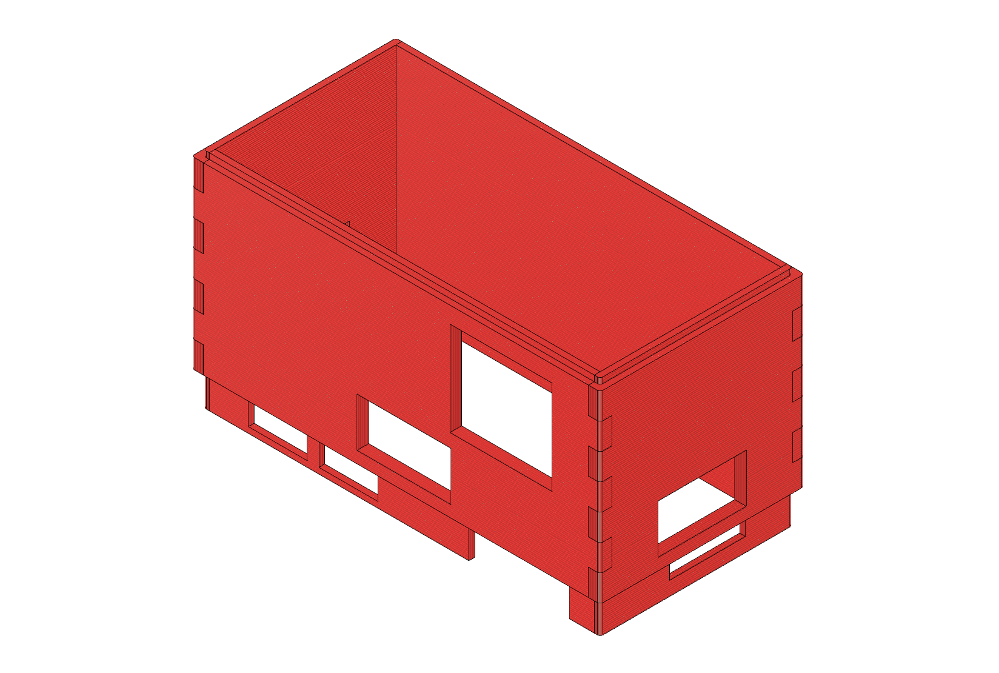
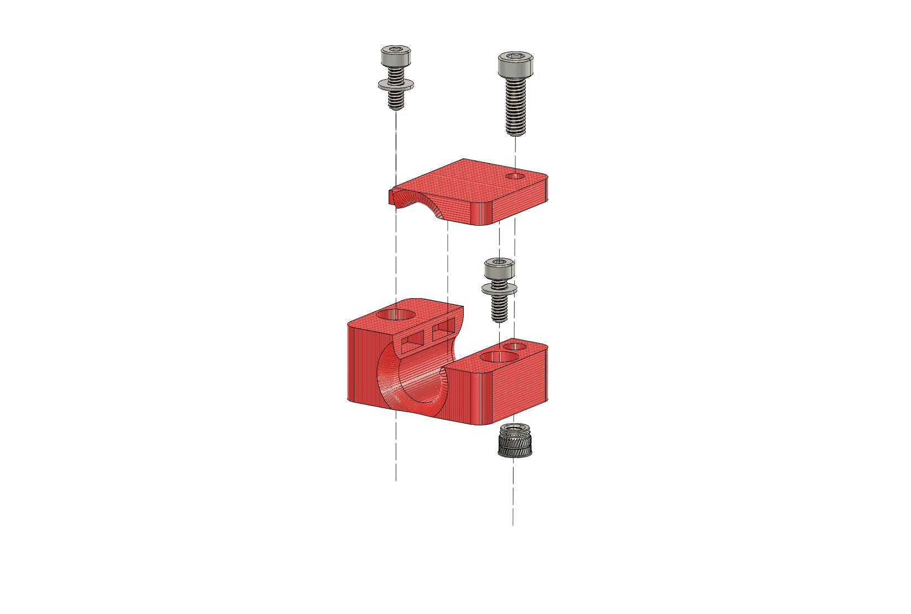

# Bill of Materials

## Part Locations

_(note that pngs with labels have draw.io diagrams embedded in them and can be edited in-place using [draw.io github mode](https://www.draw.io/?mode=github))_

### Left View/  Starboard Side

### Front View

### Right View / Port Side
 

## Part Schedule

### Raw Materials (RM)

| Part Number | Manufacturer | Mgf. Part No.   | Description               | SDS | TDS | Link
|-------------|--------------|-----------------|---------------------------|-----|-----|--------------|
|      RM0546 | hatchbox     | 3D PETG-1KG1.75-RED  | Red 1.75mm PETG Filament  | | | [hatchbox3d.com](https://www.hatchbox3d.com/collections/petg-1-75mm/products/3d-petg-1kg1-75-red ) |
|      RM0054 | Prusa3d      | Prusament PC Blend Carbon Fiber Black 800g | Black 1.75mm Polycarbonate Filament | | |[prusa3d.com](https://www.prusa3d.com/product/prusament-pc-blend-carbon-fiber-black-800g-2/) |
|      RM0543 | FilaFlex     | FilaFlexible40       | White 1.75mm Flex Filament, Shore D40 | | | [prusa3d.com](https://www.prusa3d.com/product/filatech-filaflexible40-natural-white-filament-500g/) |
|      RM0126 | Prusa3d      | prusament-pvb-natural-transparent-500g | Transparent 1.75mm PVB Filament | | | [prusa3d.com](https://www.prusa3d.com/product/prusament-pvb-natural-transparent-500g/)|
|      RM0675 | Permabond    | Permabond 240        | Instant Bond Adhesive     | [✓](./datasheets/sds/1570600%20GHS%20240%20021318.pdf)| [✓](./datasheets/tds/240_TDS.pdf) |[mcmaster.com](https://www.mcmaster.com/7580A85/) |
|      RM0714 | 3M           | DP100                | 3M™ Scotch-Weld™ Epoxy Adhesive DP100 | [✓](./datasheets/tds/DP100.pdf) | [✓](./datasheets/sds/DP100.pdf) | [amazon](https://www.amazon.com/gp/product/B07G561G2C) |
|      RM0672 | 3M           | DP8005               | 3M™ Scotch-Weld™ Epoxy Adhesive DP8005 | [✓](./datasheets/tds/DP8005.pdf) | [✓](./datasheets/sds/DP8005.pdf) | [amazon](https://www.amazon.com/gp/product/B007IATIK8) |

### Custom FFF Parts (CF)

<table>
<thead>
<th>Material</th>
<th>Part Number</th>
<th>Description</th>
<th>Step File</th>
<th>GCode File</th>
<th>Printer</th>
<th>Nozzle</th>
<th>Layer Height</th>
<th>Printing Notes</th>
</thead>
<tbody valign="top">
<tr>
<td rowspan="6">RM0546</td>
<td>CF0531</td>
<td>Dragon Beard dust guard: front plate</td>
<td><a href="./models/02_parts_custom/process_fff/dragon_beard_dust_cover_front.step">✓</a></td>
<td rowspan="4"><a href="./gcode/dragon_beard_dustcover_0.15mm_PETG_MINI_1h24m.gcode">✓</a></td>
<td>Prusa Mini+ (modified)</td>
<td>0.40</td>
<td>0.15</td>
<td>
<ul>
    <li>Infill: Rectilinear 100%</li>
    <li>No supports</li>
    <li>powder-coated sheet w/ gluestick</li>
    <li>no-enclosure</li>
</ul>
</td>
</tr>
<tr>
<td>CF0532</td>
<td>Dragon Beard dust guard: side plate, port</td>
<td><a href="./models/02_parts_custom/process_fff/dragon_beard_dust_cover_port.step">✓</a></td>
<td>Prusa Mini+ (modified)</td>
<td>0.40</td>
<td>0.15</td>
<td>
<ul>
    <li>Infill: Rectilinear 100%</li>
    <li>No supports</li>
    <li>powder-coated sheet w/ gluestick</li>
    <li>no-enclosure</li>
</ul>
</td>
</tr>
<tr>
<td>CF0533</td>
<td>Dragon Beard dust guard: rear plate</td>
<td><a href="./models/02_parts_custom/process_fff/dragon_beard_dust_cover_rear.step">✓</a></td>
<td>Prusa Mini+ (modified)</td>
<td>0.40</td>
<td>0.15</td>
<td>
<ul>
    <li>Infill: Rectilinear 100%</li>
    <li>No supports</li>
    <li>powder-coated sheet w/ gluestick</li>
    <li>no-enclosure</li>
</ul>
</td>
</tr>
<tr>
<td>CF0534</td>
<td>Dragon Beard dust guard: side plate, starboard</td>
<td><a href="./models/02_parts_custom/process_fff/dragon_beard_dust_cover_starboard.step">✓</a></td>
<td>Prusa Mini+ (modified)</td>
<td>0.40</td>
<td>0.15</td>
<td>
<ul>
    <li>Infill: Rectilinear 100%</li>
    <li>No supports</li>
    <li>powder-coated sheet w/ gluestick</li>
    <li>no-enclosure</li>
</ul>
</td>
</tr>
</tr>
<tr>
<td>CF0535</td>
<td>Ethernet Cable Guide, top</td>
<td><a href="./models/02_parts_custom/process_fff/dragon_neck_ethernet_guide_top.step">✓</a></td>
<td rowspan="2"><a href="./gcode/Ethernet_guide_0.15mm_PETG_MINI_59m.gcode">✓</a></td>
<td>Prusa Mini+ (modified)</td>
<td>0.40</td>
<td>0.15</td>
<td>
<ul>
    <li>Infill: Rectilinear 100%</li>
    <li>No supports</li>
    <li>powder-coated sheet w/ gluestick</li>
    <li>no-enclosure</li>
</ul>
</td>
</tr>
<tr>
<td>CF0536</td>
<td>Ethernet Cable Guide, bottom</td>
<td><a href="./models/02_parts_custom/process_fff/dragon_neck_ethernet_guide_bottom.step">✓</a></td>
<td>Prusa Mini+ (modified)</td>
<td>0.40</td>
<td>0.15</td>
<td>
<ul>
    <li>Infill: Rectilinear 100%</li>
    <li>No supports</li>
    <li>powder-coated sheet w/ gluestick</li>
    <li>no-enclosure</li>
</ul>
</td>
</tr>
</tbody>
</table>

### Assemblies (AS)

| Image | Part Number | Sub-Parts | Description | Assembly Instructions |
|-------|-------------|-----------|-------------|-----------------------|
|  | AS1332  | <ul><li>CF0531</li><li>CF0532</li><li>CF0533</li><li>CF0534</li></ul> | Dragon Beard Dust Cover | (TODO) | 
|  | AS1333  | <ul><li>CF0535</li><li>CF0536</li></ul> | Ethernet cable guide | (TODO) | 