
`l3xz-hw-pan-tilt-head`
=======================

This repository contains the design files for [L3X-Z](https://github.com/107-systems/l3xz)'s pan/tilt color/thermal camera head.

  

## Overview
_(note that pngs with labels have draw.io diagrams embedded in them and can be edited using draw.io)_

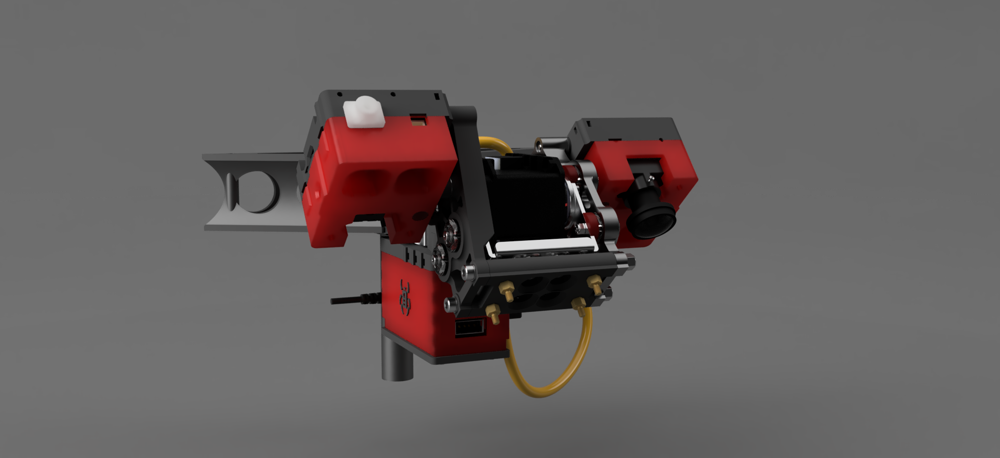

### Left View/  Starboard Side
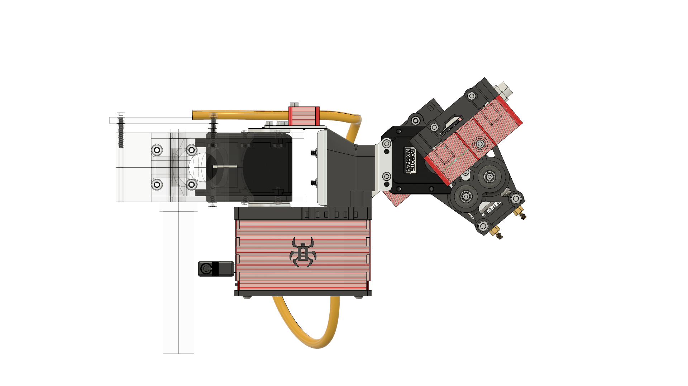

### Front View
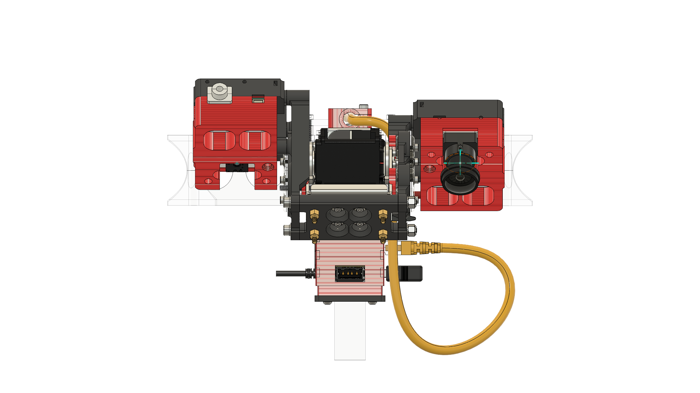

### Right View / Port Side
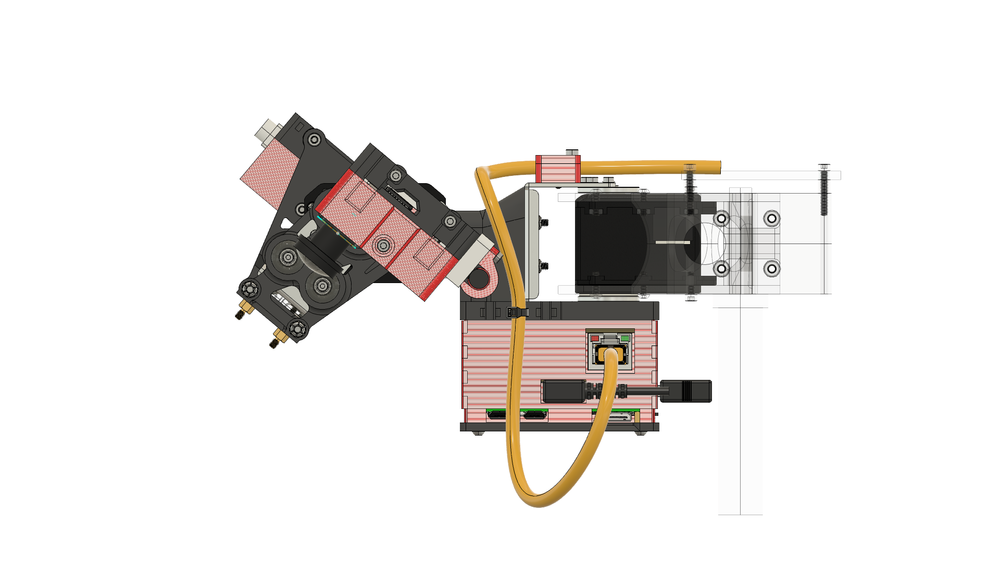 

### Top View
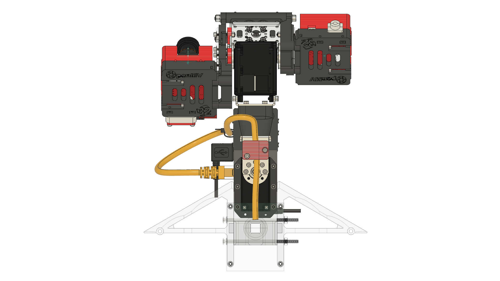

### Bottom View
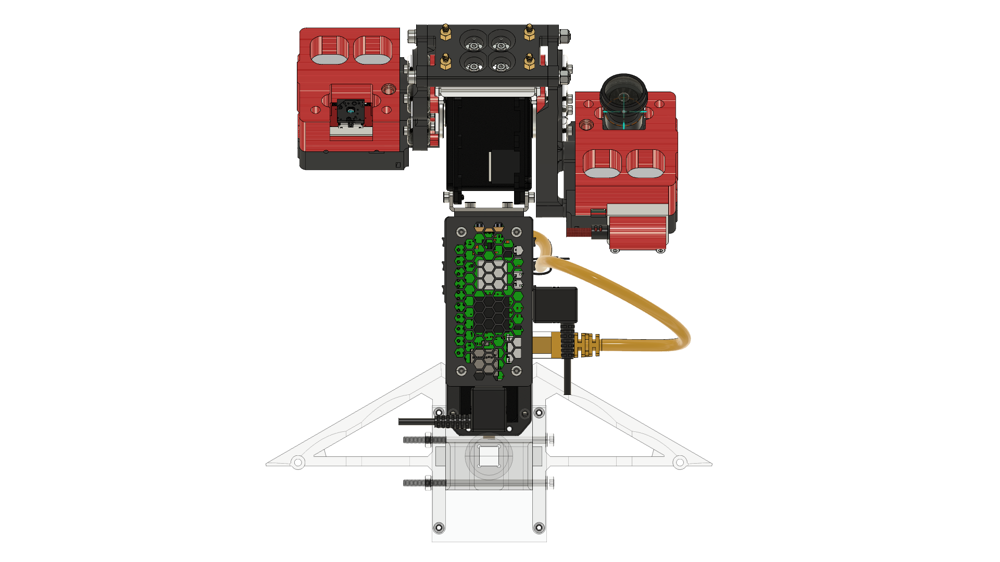

### Rear View
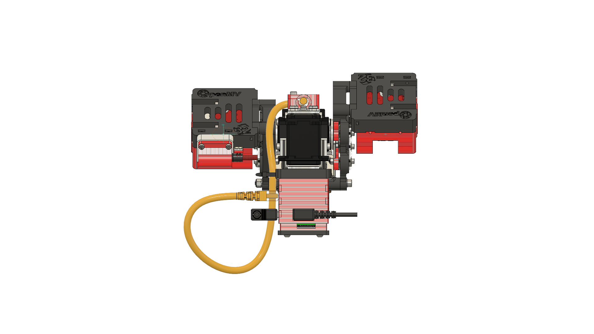 

### Vibration Isolation Mount Detail
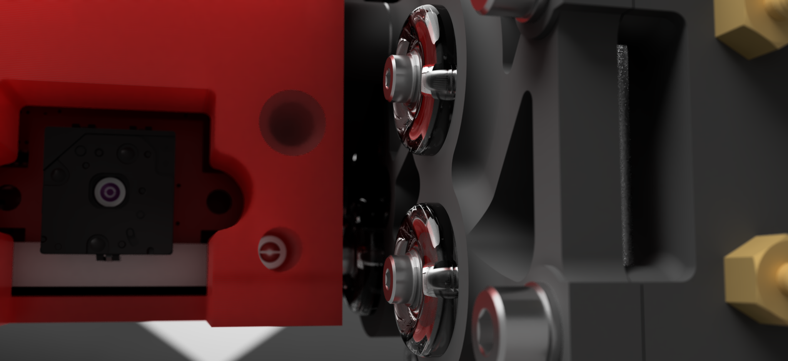 

### Motion Study
[AS1338 motion study](./media/AS1338_MOTION.mp4) 

## Bill of Materials

### Raw Materials (RM)

| Part Number | Manufacturer | Mgf. Part No.        | Description               | SDS | TDS | Link
|-------------|--------------|----------------------|---------------------------|-----|-----|--------------|
|      RM0546 | hatchbox     | 3D PETG-1KG1.75-RED  | Red 1.75mm PETG Filament  | | | [hatchbox3d.com](https://www.hatchbox3d.com/collections/petg-1-75mm/products/3d-petg-1kg1-75-red ) |
|      RM0054 | Prusa3d      | Prusament PC Blend Carbon Fiber Black 800g | Black 1.75mm Polycarbonate Filament | | |[prusa3d.com](https://www.prusa3d.com/product/prusament-pc-blend-carbon-fiber-black-800g-2/) |
|      RM0543 | FilaFlex     | FilaFlexible40       | White 1.75mm Flex Filament, Shore D40 | | | [prusa3d.com](https://www.prusa3d.com/product/filatech-filaflexible40-natural-white-filament-500g/) |
|      RM0126 | Prusa3d      | prusament-pvb-natural-transparent-500g | Transparent 1.75mm PVB Filament | | | [prusa3d.com](https://www.prusa3d.com/product/prusament-pvb-natural-transparent-500g/)|
|      RM0675 | Permabond    | Permabond 240        | Instant Bond Adhesive     | [✓](./datasheets/sds/1570600%20GHS%20240%20021318.pdf)| [✓](./datasheets/tds/240_TDS.pdf) |[mcmaster.com](https://www.mcmaster.com/7580A85/) |
|      RM0714 | 3M           | DP100                | 3M™ Scotch-Weld™ Epoxy Adhesive DP100 | [✓](./datasheets/tds/DP100.pdf) | [✓](./datasheets/sds/DP100.pdf) | [amazon](https://www.amazon.com/gp/product/B07G561G2C) |
|      RM0672 | 3M           | DP8005               | 3M™ Scotch-Weld™ Epoxy Adhesive DP8005 | [✓](./datasheets/tds/DP8005.pdf) | [✓](./datasheets/sds/DP8005.pdf) | [amazon](https://www.amazon.com/gp/product/B007IATIK8) |
|      RM0879 | (generic)    | B07XFMPQR1           | 304 Stainless Steel Woven Wire 120 Mesh Fine Screen | | | [amazon](https://www.amazon.com/gp/product/B07XFMPQR1) |
|      RM0889 | 3M           | AC79                 | 3M Scotch-Weld Instant Adhesive Primer | [✓](./datasheets/sds/AC79.pdf) | [✓](./datasheets/tds/AC79.pdf) | [amazon](https://www.amazon.com/gp/product/B071W9H889) |
|      RM0890 | Loctite      | Threadlocker Blue 242 | Removable thread locker to prevent self-loosening | [✓](./datasheets/sds/loctite_blue.pdf) | [✓](./datasheets/tds/loctite_blue.pdf) | [loctite](https://www.loctiteproducts.com/en/products/specialty-products/specialty/loctite_threadlockerblue242.html) |
|      RM0318 | Eclectic     | E6000                | Flexible, clear adhesive | | [✓](./datasheets/tds/tds-e6000-craft-us-ca-me-au-nz-mex.pdf) | [eclectic](https://eclecticproducts.com/product/e6000-industrial-adhesive/)|

### Custom FFF Parts (CF)

* Unless otherwise specified, all gcode was generated from step files using PrusaSlicer 2.6.0-alpha3+MacOS-x64
* Unless otherwise specified, all gcode was generated for a Prusa Mini+
* Unless otherwise specified, all gcode was generated for a 0.40 mm nozzle.

<table>
<thead>
<th>
    <strong>Material ID</strong> 
    &gt;&nbsp;Filament Profile
</th>
<th>Count</th>
<th>Part Number</th>
<th>Thumbnail</th>
<th>Description</th>
<th>Step File</th>
<th>GCode File</th>
<th>Layer Height</th>
<th>Printing Notes</th>
</thead>
<tbody valign="top">
<tr>
<td rowspan="10">
    <strong>RM0546</strong> 
    &gt;&nbsp;Generic PETG
</td>
<td>1</td>
<td>CF0531</td>
<td>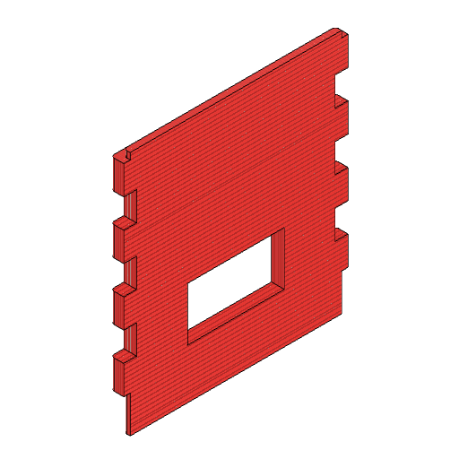</td>
<td>Dragon Beard dust guard: front plate</td>
<td><a href="./models/02_parts_custom/process_fff/dragon_beard_dust_cover_front.step">✓</a></td>
<td rowspan="4"><a href="./gcode/dragon_beard_dustcover_0.15mm_PETG_MINI_1h24m.gcode">✓</a></td>
<td rowspan="10">0.15</td>
<td rowspan="8">
<ul>
    <li>Infill: Rectilinear 100%</li>
    <li>No supports</li>
    <li>powder-coated sheet w/ glue-stick</li>
    <li>no-enclosure</li>
</ul>
</td>
</tr>
<tr>
<td>1</td>
<td>CF0532</td>
<td>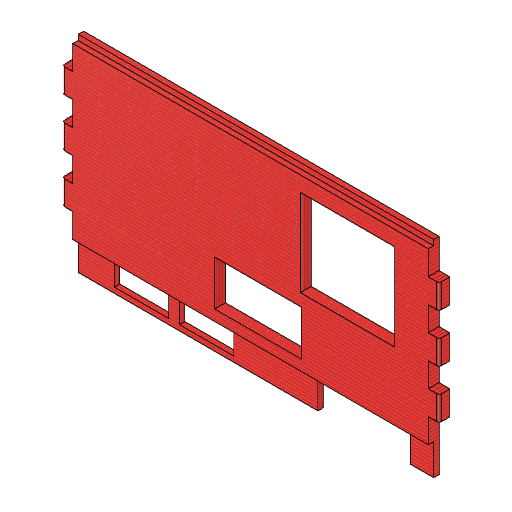</td>
<td>Dragon Beard dust guard: side plate, port</td>
<td><a href="./models/02_parts_custom/process_fff/dragon_beard_dust_cover_port.step">✓</a></td>
</tr>
<tr>
<td>1</td>
<td>CF0533</td>
<td>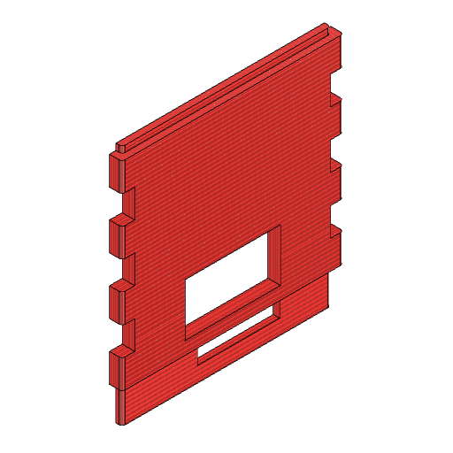</td>
<td>Dragon Beard dust guard: rear plate</td>
<td><a href="./models/02_parts_custom/process_fff/dragon_beard_dust_cover_rear.step">✓</a></td>
</tr>
<tr>
<td>1</td>
<td>CF0534</td>
<td>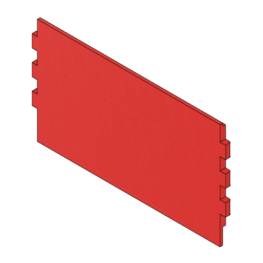</td>
<td>Dragon Beard dust guard: side plate, starboard</td>
<td><a href="./models/02_parts_custom/process_fff/dragon_beard_dust_cover_starboard.step">✓</a></td>
</tr>
</tr>
<tr>
<td>1</td>
<td>CF0535</td>
<td>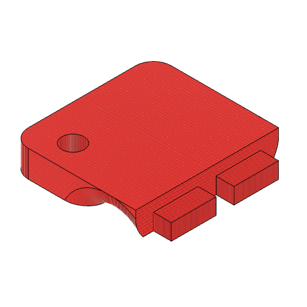</td>
<td>Ethernet Cable Guide, top</td>
<td><a href="./models/02_parts_custom/process_fff/dragon_neck_ethernet_guide_top.step">✓</a></td>
<td rowspan="2"><a href="./gcode/Ethernet_guide_0.15mm_PETG_MINI_59m.gcode">✓</a></td>
</tr>
<tr>
<td>1</td>
<td>CF0536</td>
<td>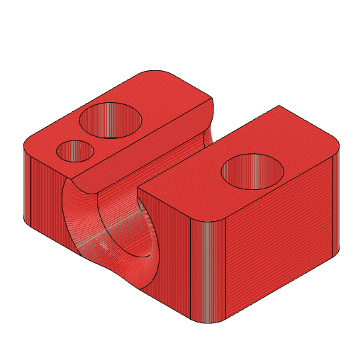</td>
<td>Ethernet Cable Guide, bottom</td>
<td><a href="./models/02_parts_custom/process_fff/dragon_neck_ethernet_guide_bottom.step">✓</a></td>
</tr>
<tr>
<td>2</td>
<td>CF0538</td>
<td>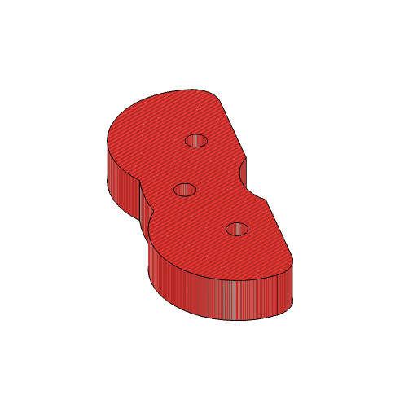</td>
<td>Axial Squash Plate</td>
<td><a href="./models/02_parts_custom/process_fff/dragon_eye_squashplate_axial.step">✓</a></td>
<td rowspan="2"><a href="./gcode/squash_plates_0.15mm_PETG_MINI_27m.gcode">✓</a></td>
</tr>
<tr>
<td>4</td>
<td>CF0539</td>
<td>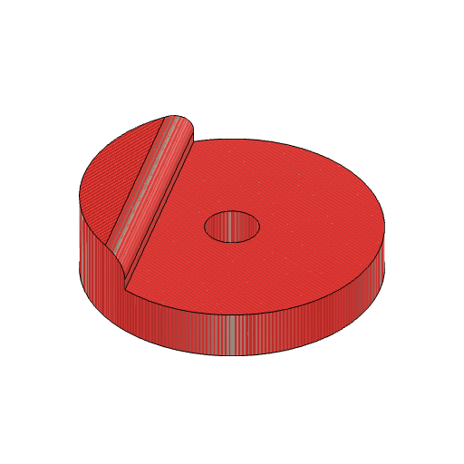</td>
<td>Distal Squash Plate</td>
<td><a href="./models/02_parts_custom/process_fff/dragon_eye_squashplate.step">✓</a></td>
</tr>
<tr>
<td>2</td>
<td>CF0537</td>
<td></td>
<td>OpenMV H7 Case, Front</td>
<td><a href="./models/02_parts_custom/process_fff/omvh732_front.step">✓</a></td>
<td><a href="./gcode/omvh732_front_0.15mm_PETG_MINI_2h7m.gcode">✓</a></td>
<td>
<ul>
    <li>Infill: Gyroid 20%</li>
    <li>Solid infill threshold area: 200mm2</li>
    <li>No supports</li>
    <li>powder-coated sheet w/ glue-stick</li>
    <li>no-enclosure</li>
</ul>
</td>
</tr>
<tr>
<td>2</td>
<td>CF0562</td>
<td>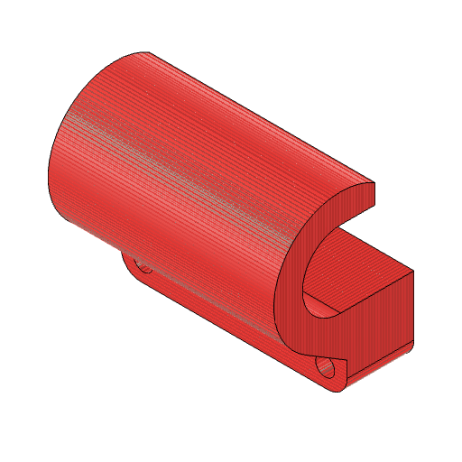</td>
<td>OpenMV H7 Case, USB Retainer</td>
<td></td>
<td><a href="./gcode/omvh732_usb_retainer_0.15mm_PETG_MINI_39m.gcode">✓</a></td>
<td>
<ul>
    <li>Infill: Rectilinear 100%</li>
    <li>Custom Support</li>
    <li>Support Style: Snug</li>
    <li>powder-coated sheet w/ glue-stick</li>
    <li>no-enclosure</li>
</ul>
</td>
</tr>
<tr>
<td rowspan="6">
    <strong>RM0543</strong> 
    &gt;&nbsp;Filatech FilaFlex40
</td>
<td>2</td>
<td>CF0540</td>
<td>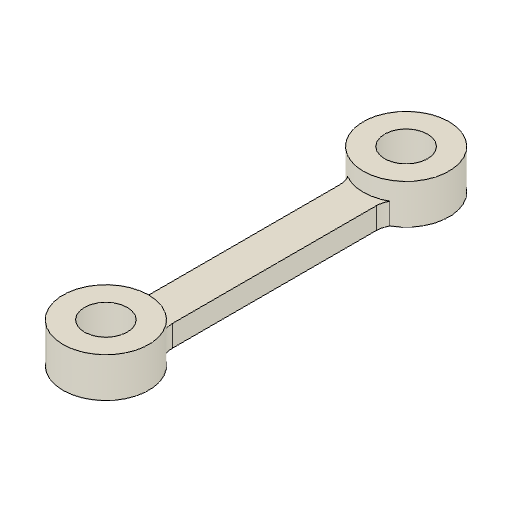</td>
<td>OpenMV H7 Case, soft-mount, rear.</td>
<td><a href="./models/02_parts_custom/process_fff/omvh732_softmount_rear.step">✓</a></td>
<td rowspan="4"><a href="./gcode/omvh732_softparts_0.2mm_FLEX_MINI_34m.gcode">✓</a></td>
<td rowspan="7">0.20</td>
<td rowspan="7">
<ul>
    <li>Infill: Rectilinear 100%</li>
    <li>No supports</li>
    <li>brim</li>
    <li>powder-coated sheet w/ glue-stick</li>
    <li>no-enclosure</li>
</ul>
</td>
</tr>
<tr>
<td>2</td>
<td>CF0541</td>
<td>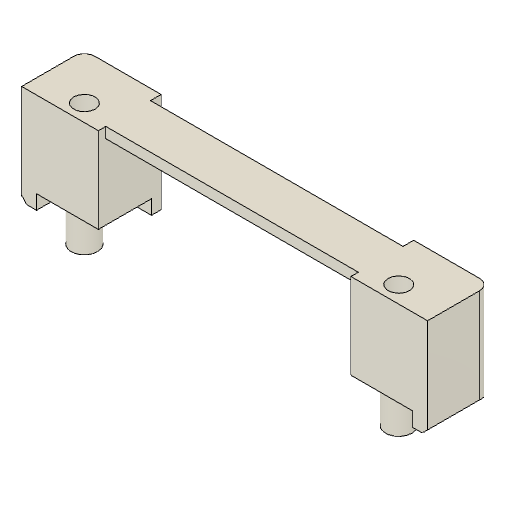</td>
<td>OpenMV H7 Case, soft-mount, front-top.</td>
<td><a href="./models/02_parts_custom/process_fff/omhv732_softmount_front_top.step">✓</a></td>
</tr>
<tr>
<td>2</td>
<td>CF0542</td>
<td>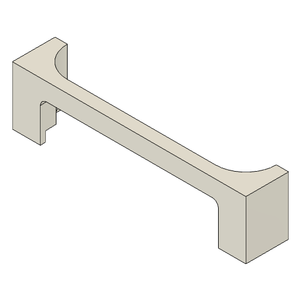</td>
<td>OpenMV H7 Case, soft-mount, front-bottom.</td>
<td><a href="./models/02_parts_custom/process_fff/omhv732_softmount_front_bottom.step">✓</a></td>
</tr>
<tr>
<td>4</td>
<td>CF0543</td>
<td>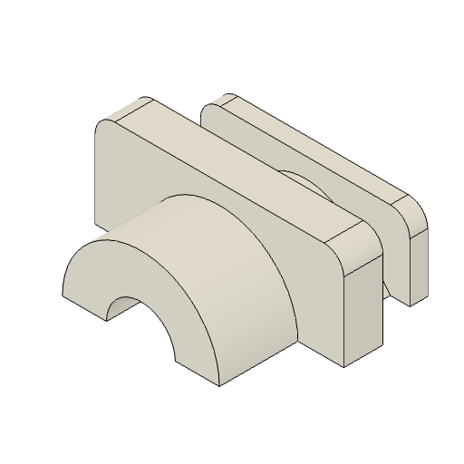</td>
<td>OpenMV H7 Case, no-connector strain-relief.</td>
<td><a href="./models/02_parts_custom/process_fff/openmv-h7-body-strain-relief.step">✓</a></td>
</tr>
<tr>
<td>1</td>
<td>CF0580</td>
<td>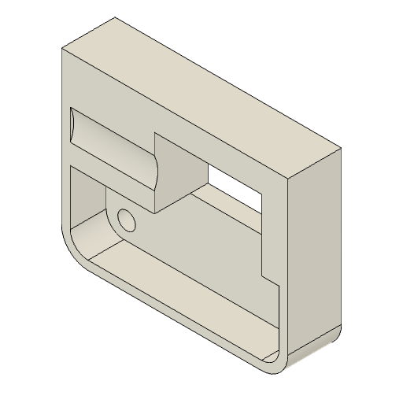</td>
<td>OpenMV H7 Case, AAOTOKK USB Micro Retainer Gasket.</td>
<td><a href="./models/02_parts_custom/process_fff/omvh732_usb_retainer_gasket.step">✓</a></td>
<td><a href="./gcode/d.15mm_FLEX_MINI_20m.gcode">✓</a></td>
</tr>
<tr>
<td>7</td>
<td>CF0581</td>
<td>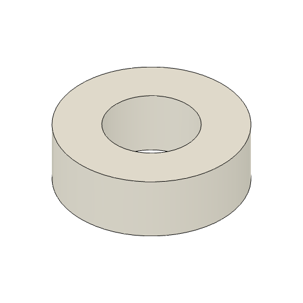</td>
<td>Dragon Ear ISO mount spacers</td>
<td><a href="models/02_parts_custom/process_fff/dragon_ear_iso_spacer.step">✓</a></td>
<td><a href="./gcode/iso_spacer_0.2mm_FLEX_MINI_7m.gcode">✓</a></td>
</tr>
<tr>
<td>
    <strong>RM0126</strong> 
    &gt; Prusament PVB
</td>
<td>2</td>
<td>CF0544</td>
<td>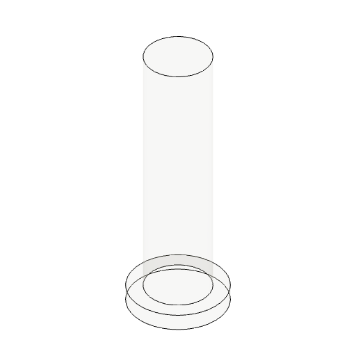</td>
<td>OpenMV H7 Case, light-pipe.</td>
<td><a href="./models/02_parts_custom/process_fff/omhv732_lightpipe_front.step">✓</a></td>
<td><a href="./gcode/omvh732_lightpipe_0.2mm_PVB_MINI_5m.gcode">✓</a></td>
</tr>
<tr>
<td rowspan="10">
    <strong>RM0054</strong> 
    &gt;&nbsp;Prusament&nbsp;PC&nbsp;Blend&nbsp;Carbon&nbsp;Fiber&nbsp;+
    <ul>
    <li>extrusion mult. .97</li>
    <li>nozzle temp: 290˚ (all layers)</li>
    <li>enclosure, 32˚</li>
    </ul>
</td>
<td>1</td>
<td>CF0545</td>
<td>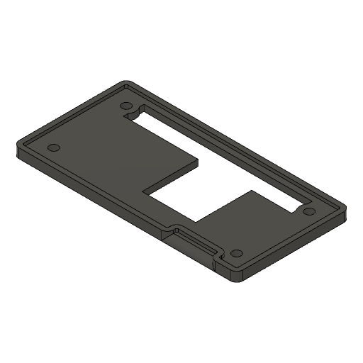</td>
<td>Dragon Beard boot: design variant 1</td>
<td><a href="./models/02_parts_custom/process_fff/dragon_beard_boot_d1.step">✓</a></td>
<td><a href="./gcode/boot_d1_0.15mm_PC_MINI_39m.gcode">✓</a></td>
<td rowspan="8">0.15</td>
<td rowspan="4">
<ul>
    <li>Infill: Rectilinear 100%</li>
    <li>No supports</li>
    <li>powder-coated sheet</li>
</ul>
</td>
</tr>
<tr>
<td>1</td>
<td>CF0546</td>
<td></td>
<td>Dragon Beard boot: design variant_2</td>
<td><a href="./models/02_parts_custom/process_fff/dragon_beard_boot_d2.step">✓</a></td>
<td><a href="./gcode/boot_d2_0.15mm_PC_MINI_39m.gcode">✓</a></td>
</tr>
<tr>
<td>1</td>
<td>CF0547</td>
<td>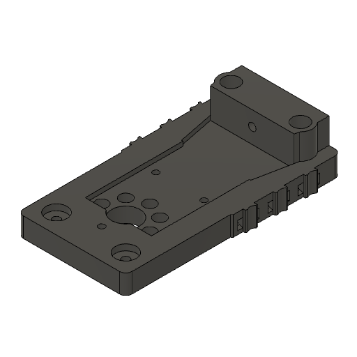</td>
<td>Dragon Beard hanger</td>
<td><a href="./models/02_parts_custom/process_fff/dragon_beard_hanger.step">✓</a></td>
<td><a href="./gcode/hanger_0.15mm_PC_MINI_2h8m.gcode">✓</a></td>
</tr>
<tr>
<td>1</td>
<td>CF0548</td>
<td>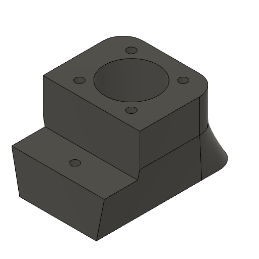</td>
<td>Dragon Beard neck (25mm)</td>
<td><a href="./models/02_parts_custom/process_fff/dragon_neck_25mm.step">✓</a></td>
<td><a href="./gcode/neck_25mm_0.15mm_PC_MINI_2h9m.gcode">✓</a></td>
</tr>
<tr>
<td>1</td>
<td>CF0549</td>
<td></td>
<td>Dragon Nose</td>
<td><a href="./models/02_parts_custom/process_fff/dragon_nose.step">✓</a></td>
<td><a href="./gcode/nose_0.15mm_PC_MINI_1h9m.gcode">✓</a></td>
<td rowspan="2">
<ul>
    <li>Infill: Honeycomb 30%</li>
    <li>4 perimeters (min)</li>
    <li>Bottom layer: Archimedean Chords</li>
    <li>Custom supports</li>
    <li>Support Style: Snug</li>
    <li>powder-coated sheet</li>
</ul>
</td>
</tr>
<tr>
<td>2</td>
<td>CF0550</td>
<td></td>
<td>OpenMV H7 Case: Rear</td>
<td><a href="./models/02_parts_custom/process_fff/omvh732_rear.step">✓</a></td>
<td><a href="./gcode/omvh732_rear_0.15mm_PC_MINI_1h43m.gcode">✓</a></td>
</tr>
<tr>
<td>1</td>
<td>CF0552</td>
<td></td>
<td>Dragon Ear: Port-side</td>
<td><a href="./models/02_parts_custom/process_fff/dragon_ear_port.step">✓</a></td>
<td><a href="./gcode/dragon_ear_port_0.15mm_PC_MINI_2h5m.gcode">✓</a></td>
<td>
<ul>
    <li>Infill: Rectilinear 100%</li>
    <li>8 perimeters (min)</li>
    <li>Custom supports</li>
    <li>Support Style: Snug, 2mm xy separation</li>
    <li>powder-coated sheet</li>
</ul>
</td>
</tr>
<tr>
<td>2</td>
<td>CF0554</td>
<td>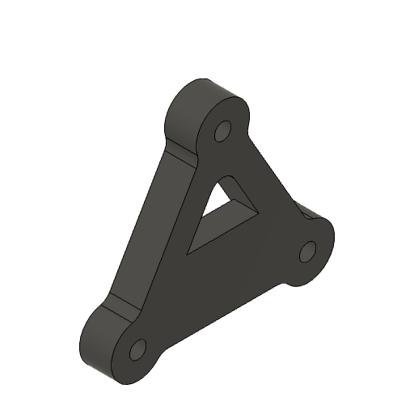</td>
<td>OpenMV H7 Case: mounting adapter</td>
<td><a href="./models/02_parts_custom/process_fff/omvh732_adapter.step">✓</a></td>
<td><a href="./gcode/omv732_adapter_0.15mm_PC_MINI_39m.gcode">✓</a></td>
<td>0.10</td>
<td>
<ul>
    <li>Infill: Rectilinear 100%</li>
    <li>powder-coated sheet</li>
</ul>
</td>
</tr>
<tr>
<td>1</td>
<td>CF0551</td>
<td>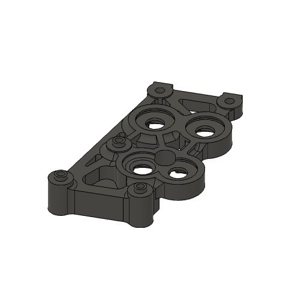</td>
<td>Dragon Ear: Starboard-side</td>
<td><a href="./models/02_parts_custom/process_fff/dragon_ear_starboard.step">✓</a></td>
<td><a href="./gcode/dragon_ear_starboard_0.15mm_PC_MINI_1h54m.gcode">✓</a></td>
<td>
<ul>
    <li>Infill: Rectilinear 100%</li>
    <li>8 perimeters (min)</li>
    <li>Custom supports</li>
    <li>Support Style: Snug, 2mm xy separation</li>
    <li>powder-coated sheet</li>
</ul>
</td>
</tr>
<tr>
<td>1</td>
<td>CF0553</td>
<td>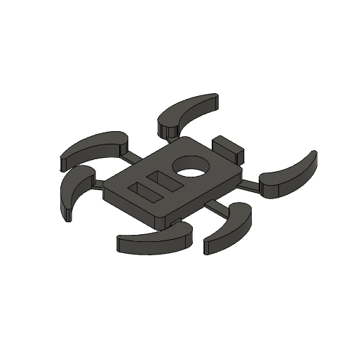</td>
<td>Hexapod Emblem</td>
<td><a href="./models/00_marks_and_decals/hexapod makers mark.step">✓</a></td>
<td><a href="./gcode/hexapod_logo_0.1mm_PC_MINI_3m.gcode">✓</a></td>
<td>0.10</td>
<td>
<ul>
    <li>Infill: Rectilinear 100%</li>
    <li>powder-coated sheet</li>
</ul>
</td>
</tr>
</tbody>
</table>

### Electrical (EL)

| Ct. | Part Number | Mgfr. Part Number   | Description | Link |
|-----|-------------|---------------------|-------------|------|
| 2   | EL2112      | openmv-cam-h7-r2    | Open Machine Vision camera module. | [openmv.io](https://openmv.io/collections/cams/products/openmv-cam-h7-r2) |
| 1   | EL2113      | flir-lepton-adapter-module | OpenMV camera module adapter for FLIR lepton. | [openmv.io](https://openmv.io/collections/cams/products/flir-lepton-adapter-module)
| 1   | EL2114      | flir-lepton-3-5     | FLIR Lepton imaging module. | [groupgets.com](https://store.groupgets.com/products/flir-lepton-3-5) |
| 1   | EL2115      | Raspberry Pi Zero 2 W    | SBC compute module | [raspberrypi.com](https://www.raspberrypi.com/products/raspberry-pi-zero-2-w/) |
| 1   | EL2116      | PoE/ETH/USB HUB HAT | PoE hat for EL2115 | [waveshare.com](https://www.waveshare.com/poe-eth-usb-hub-hat.htm) |
| 2   | EL2117      | 902-0095-000        | DYNAMIXEL MX-28AR servo | [robotis.com](https://www.robotis.us/dynamixel-mx-28ar/) |

### Assemblies (AS)

| Ct. | Part Number | Image     | Anim. | Description |
|-----|-------------|-----------|-------|-------------|
| 1   | AS1334      | [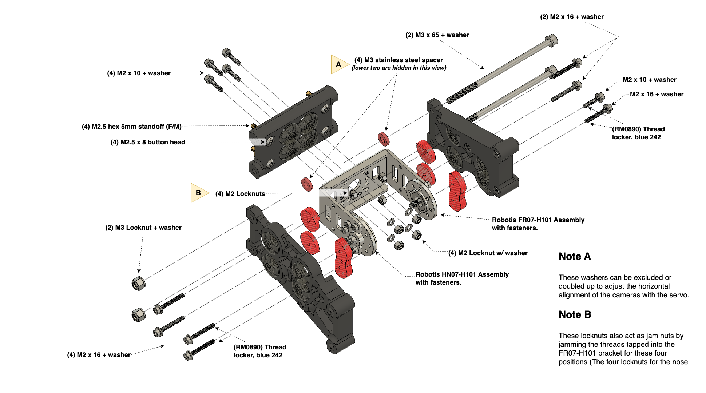](./media/AS1334.png) | [✓](./media/AS1334.mp4) | Dragon Face|
| 1   | AS1335       | [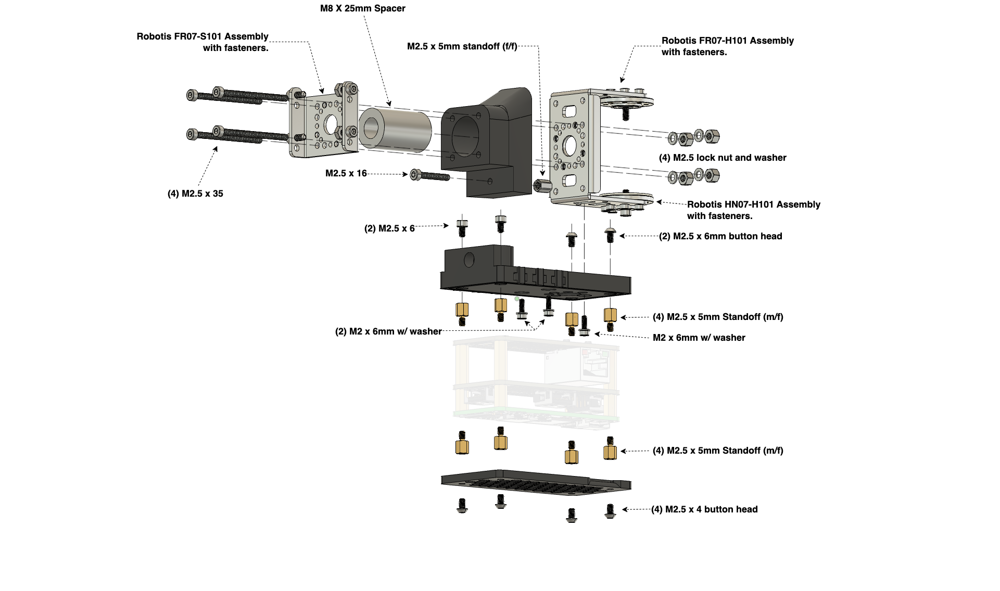](./media/AS1335.png) | [✓](./media/AS1335.mp4) | Dragon Throat|
| 1   | AS1336       | [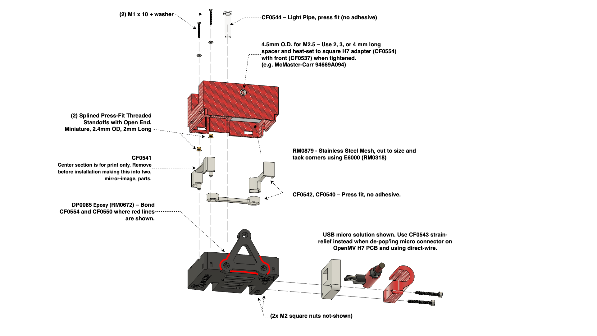](./media/AS1336.png) | [✓](./media/AS1336.mp4) | OpenMV H7 Camera Enclosure |
| 1   | AS1337       | [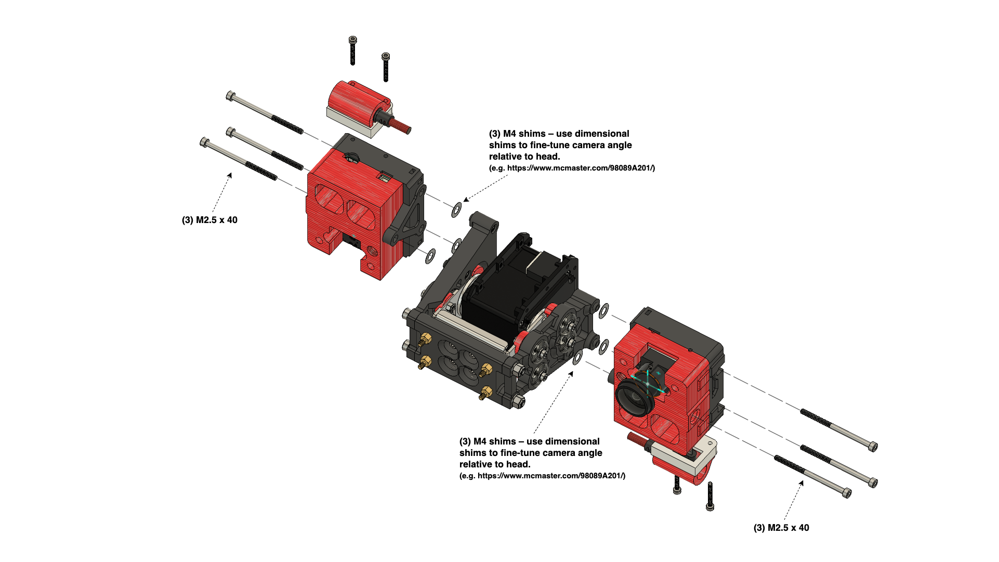](./media/AS1337.png) | [✓](./media/AS1337.mp4) | Camera Head |
| 1   | AS1338       | [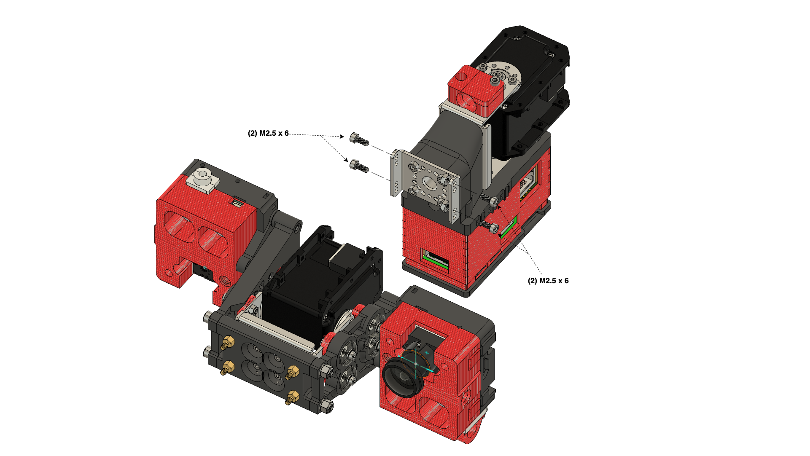](./media/AS1338.png) | | Main Assembly |
